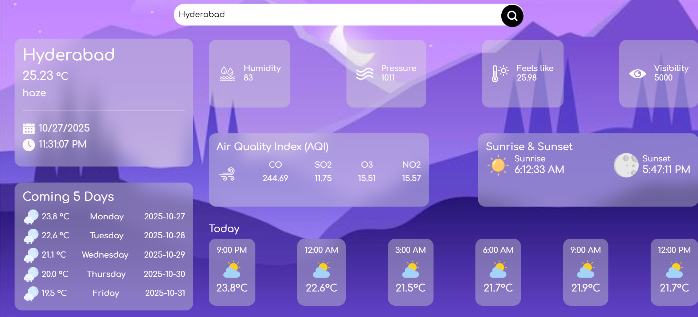

# 🌤️ Live Weather App

A sleek and modern **Live Weather App** built using **HTML, CSS, JavaScript**, and the **OpenWeather API**.  
It provides **real-time weather data**, **hourly forecasts**, **5-day predictions**, and **air quality insights** — all in an elegant, glassy UI.

---

## ✨ Features

- 🔍 **Search any city** worldwide and get instant live weather updates  
- 🌡️ **Current weather details** – temperature, humidity, pressure, and feels-like temperature  
- ☁️ **Sky condition** – clear, cloudy, rainy, etc.  
- 🌅 **Sunrise and sunset times** for the location  
- 💨 **Air Quality Index (AQI)** with CO, SO₂, O₃, and NO₂ values  
- 🕒 **Today’s hourly forecast** (in 3-hour intervals)  
- 📅 **5-day forecast** view  
- 🎨 **Beautiful glassmorphism UI** with live background  

---

## 🛠️ Tech Stack

- **Frontend:** HTML5, CSS3, JavaScript (ES6), Bootstrap 5  
- **API:** [OpenWeatherMap API](https://openweathermap.org/api)  
- **Libraries:** jQuery for DOM updates and async handling  

---

## ⚙️ API Endpoints Used

| Type | Endpoint | Description |
|------|-----------|-------------|
| Current Weather | `https://api.openweathermap.org/data/2.5/weather?q={city}&appid={API_KEY}&units=metric` | Fetches current weather data |
| 5-Day / 3-Hour Forecast | `https://api.openweathermap.org/data/2.5/forecast?lat={lat}&lon={lon}&appid={API_KEY}&units=metric` | Fetches 5-day forecast |
| Air Quality | `https://api.openweathermap.org/data/2.5/air_pollution?lat={lat}&lon={lon}&appid={API_KEY}` | Fetches AQI data |

---

## 🖼️ UI Screenshot

Here’s a preview of the **Live Weather App** 👇  

---

### 👩‍💻 Developed by  
**Srija Chinthakunta**
